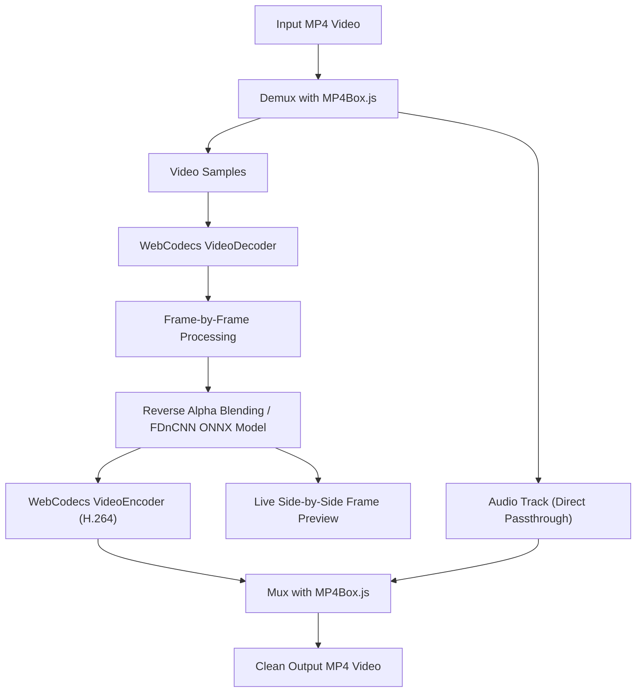

# Watermark Remover

A high-performance, privacy-first, 100% client-side watermark removal studio for both **Images** and **Videos** (including specialized cleaning for Gemini & Veo 3 AI watermarks). Built with vanilla HTML5, CSS3, ES6+ JavaScript, OpenCV.js, WebCodecs, MP4Box.js, and ONNX Runtime Web with SIMD acceleration.


---

## Features

### 🎥 Video Gemini Watermark Remover (New)
- **Gemini & Veo 3 AI Video Cleaning**: Purpose-built algorithms specifically engineered to detect, locate, and clean subtle watermarks, semi-transparent logos, and star overlays from AI-generated videos.
- **Hardware-Accelerated WebCodecs**: Uses browser-native `VideoDecoder` and `VideoEncoder` for hardware-accelerated, frame-by-frame MP4 processing without freezing the UI.
- **Deep Learning FDnCNN Models**: Powered by ONNX Runtime Web with multi-threaded WebAssembly SIMD (`ort-wasm-simd-threaded.wasm`) executing pre-trained FDnCNN neural network models (`model_core_fp32_104.onnx`, `model_core_fp32_200.onnx`, `model_core_fp32_86x74.onnx`) for artifact-free reconstruction.
- **Live Side-by-Side Comparison**: Real-time synchronized preview bridge displaying original vs. processed frames side-by-side with live FPS, elapsed time, and frame progress.
- **Lossless Audio Passthrough**: Demuxes audio streams with MP4Box.js and muxes them directly back into the output container with zero quality degradation or re-encoding delay.
- **100% Private & Local**: Video frames never leave your computer or upload to any remote server. Everything executes locally in your browser memory.
- **One-Click MP4 Export**: Generates clean, standard-compliant MP4 videos ready for immediate download.

### 🖼️ Image Watermark Remover
- **Exact Reverse Alpha Blending**: Mathematically reverses semi-transparent overlays and Gemini stars back to original background pixels.
- **Intelligent Color Deviation Detection**: Automatically isolates watermark pixels using relative chromatic deviation and multi-scale Gaussian background analysis.
- **OpenCV.js Inpainting**: Clean Telea / Navier-Stokes inpainting with adaptive safety thresholds, connected-component noise filtering, and edge blending.
- **Interactive Before / After Slider**: Visual split comparison slider to inspect fine restoration details.
- **Manual Touch-Up Brush**: Interactive brush with adjustable radius and undo support for custom retouching on complex backgrounds.
- **Batch Processing**: Upload multiple images at once with drag-and-drop, individual previews, and batch download.
- **Format Support**: Handles PNG, JPG, JPEG, WEBP, and browser-supported HEIC/HEIF files.

---

## Tech Stack

| Component | Technology | Description |
|---|---|---|
| **Frontend UI** | HTML5, CSS3, Vanilla JavaScript | Responsive dark studio interface with real-time feedback |
| **Image Processing** | OpenCV.js 4.5.4, Canvas API | Relative color deviation detection, Telea inpainting, alpha blending |
| **Video Demuxing / Muxing** | MP4Box.js | Box parsing, MP4 sample extraction, audio track passthrough |
| **Video Decoding & Encoding** | WebCodecs API | Hardware-accelerated `VideoDecoder` & `VideoEncoder` (H.264 / AVC) |
| **AI Neural Engine** | ONNX Runtime Web (WASM SIMD) | Fast multi-threaded execution of FDnCNN models in the browser |
| **Local Server** | Node.js | Serves static assets with cross-origin isolation headers for SharedArrayBuffer |

---

## Video Processing Pipeline



1. **Demux**: MP4Box.js extracts video samples and preserves original audio tracks.
2. **Decode**: `VideoDecoder` converts samples into raw `VideoFrame` instances with GPU acceleration.
3. **Reconstruct**: Reverse alpha blending and ONNX FDnCNN neural networks restore underlying pixels without blurring.
4. **Live Preview**: Cleaned frames are streamed directly to the real-time comparison canvas.
5. **Encode & Mux**: `VideoEncoder` compresses cleaned frames and MP4Box.js remuxes them with untouched audio tracks.
6. **Download**: A clean MP4 blob is generated locally for immediate download.

---

## Project Structure

```text
watermark-remover/
|-- index.html                 # Main studio interface (Image & Video tabs)
|-- server.js                  # Node.js server with WASM SIMD headers
|-- package.json               # Project scripts and dependencies
|-- mp4box.js                  # MP4Box.js library for demuxing/muxing
|-- README.md                  # Project documentation
|-- css/
|   `-- style.css              # Modern studio styling and layout
|-- js/
|   |-- app.js                 # UI controller, tab switching, and studio state
|   |-- gemini-engine.js       # Mathematical reverse alpha blending engine
|   `-- video-processor.js     # WebCodecs video processing pipeline
`-- video-runtime/             # In-browser video neural processing engine
    |-- video-preview.html     # Embedded live side-by-side preview player
    |-- video-app.js           # Live frame bridge and runner
    |-- onnxruntime/           # ONNX Runtime Web multi-threaded WASM binaries
    |   |-- ort-wasm-simd-threaded.wasm
    |   |-- ort-wasm-simd-threaded.js
    |   `-- ort-wasm-simd-threaded.asyncify.*
    `-- models/fdncnn/         # Pre-trained FDnCNN ONNX models
        |-- model_core_fp32_104.onnx
        |-- model_core_fp32_200.onnx
        `-- model_core_fp32_86x74.onnx
```

---

## Quick Start (Run Locally)

### Prerequisites
- [Node.js](https://nodejs.org/) (v16 or higher recommended)
- A modern browser with **WebCodecs** support:
  - Google Chrome (v94+)
  - Microsoft Edge (v94+)
  - Brave / Chromium-based browsers

### 1. Clone the Repository
```bash
git clone https://github.com/pawankalhansh/watermark-remover.git
cd watermark-remover
```

### 2. Start the Server
```bash
npm start
```
The server will start on port `8765` with the necessary Cross-Origin Isolation headers (`COOP` and `COEP`) required for multi-threaded WebAssembly SIMD.

### 3. Open in Browser
Visit:
```text
http://localhost:8765
```

> **Note**: If you modify client files or models, do a hard refresh with `Ctrl + F5` (or `Cmd + Shift + R` on macOS) to ensure cached WebAssembly workers and styles reload.

---

## Privacy & Security

- **Zero Cloud Uploads**: Your media files never touch any external server, cloud bucket, or third-party API.
- **Local Browser Execution**: All decoding, inpainting, neural inference, and encoding happen strictly within your browser's sandboxed environment.
- **Offline Capable**: Once the static assets and models are loaded, processing runs completely without internet connectivity.

---

## License & Disclaimer

Distributed under the [MIT License](LICENSE).

**Disclaimer**: This tool is created for educational, research, and personal productivity use. Please only process media you own or have explicit permission to modify. Always respect copyright and intellectual property rights.
